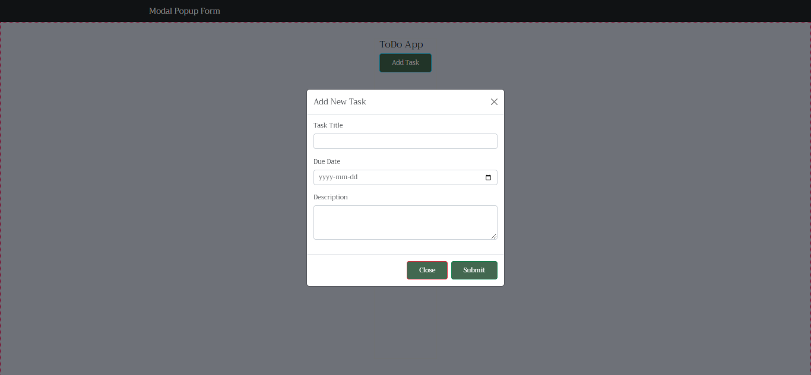

# JavaScript Form Validation Code

## Table Of Contents

# Description

- We learn about form validation approach using JavaScript by building a simple ToDo App.



# HTML

- We use Bootstrap 5, [Navbar](https://getbootstrap.com/docs/5.0/components/navbar/) and [Modal](https://getbootstrap.com/docs/5.0/components/modal/) components to design the web page.

  ```html
  <!DOCTYPE html>

  <html>
    <head>
      <meta charset="utf-8" />
      <meta http-equiv="X-UA-Compatible" content="IE=edge" />
      <title>Modal Popups Form</title>
      <meta name="description" content="" />
      <meta name="viewport" content="width=device-width, initial-scale=1" />

      <!-- Google Fonts -->
      <link
        rel="stylesheet"
        href="https://fonts.googleapis.com/css?family=Sofia|Trirong|Actor"
      />
      <!-- Font Awesome -->
      <script
        src="https://kit.fontawesome.com/592084ced4.js"
        crossorigin="anonymous"
      ></script>

      <!-- Latest compiled and minified CSS -->
      <link
        href="https://cdn.jsdelivr.net/npm/bootstrap@5.2.3/dist/css/bootstrap.min.css"
        rel="stylesheet"
      />
      <!-- Latest compiled JavaScript -->
      <script src="https://cdn.jsdelivr.net/npm/bootstrap@5.2.3/dist/js/bootstrap.bundle.min.js"></script>
      <link rel="stylesheet" href="style.css" />
    </head>
    <body>
      <header>
        <nav class="navbar navbar-expand-md bg-dark navbar-dark">
          <div class="container">
            <span class="navbar-brand">Modal Popup Form</span>
          </div>
        </nav>
      </header>
      <main>
        <section class="border">
          <div class="container">
            <div class="row">
              <div class=""><h4>ToDo App</h4></div>
            </div>
            <div class="row">
              <div class="">
                <button
                  type="button"
                  id=""
                  class="btn btn-outline-info"
                  data-bs-toggle="modal"
                  data-bs-target="#modalFormToAddTasks"
                >
                  Add Task
                </button>
                <!--Modal-->
                <form
                  id="modalFormToAddTasks"
                  class="modal"
                  tabindex="-1"
                  aria-hidden="true"
                  aria-labelledby="modalLabel"
                  action=""
                >
                  <div
                    class="modal-dialog modal-dialog-centered modal-dialog-scrollable"
                  >
                    <div class="modal-content">
                      <div class="modal-header">
                        <h5 id="modalLabel" class="modal-title">
                          Add New Task
                        </h5>
                        <button
                          type="button"
                          class="btn-close"
                          data-bs-dismiss="modal"
                          aria-label="Close"
                        ></button>
                      </div>
                      <div class="modal-body">
                        <div class="modal-body-row">
                          <label class="form-label" for="modalTitleInput"
                            >Task Title</label
                          ><input
                            id="modalTitleInput"
                            class="form-control"
                            type="text"
                          />
                          <span
                            id="titleErrorElement"
                            class="error-message"
                          ></span>
                        </div>
                        <div class="modal-body-row">
                          <label for="modalDueDateInput" class="form-label"
                            >Due Date</label
                          >
                          <input
                            id="modalDueDateInput"
                            class="form-control"
                            type="date"
                          />
                          <span
                            id="dueDateErrorElement"
                            class="error-message"
                          ></span>
                        </div>
                        <div class="modal-body-row">
                          <label for="modalDescriptionInput" class="form-label"
                            >Description</label
                          >
                          <textarea
                            id="modalDescriptionInput"
                            class="form-control"
                            rows="3"
                          ></textarea>
                          <span
                            id="descriptionErrorElement"
                            class="error-message"
                          ></span>
                        </div>
                      </div>
                      <div class="modal-footer">
                        <button
                          id="modalCloseButton"
                          class="btn btn-outline-danger"
                          type="button"
                          data-bs-dismiss="modal"
                        >
                          Close
                        </button>
                        <button
                          id="modalSubmitButton"
                          class="btn btn-outline-success"
                          type="submit"
                        >
                          Submit
                        </button>
                      </div>
                    </div>
                  </div>
                </form>
              </div>
            </div>
          </div>
        </section>
      </main>
      <script src="script.js" async defer></script>
    </body>
  </html>
  ```

# CSS

- Style the page as follows:

  ```css
  body {
    font-family: "Trirong", serif;
    background: #e5e5e5;
    height: 100vh;
    display: flex;
    flex-flow: column nowrap;
  }
  main {
    border: 2px dotted #ff004d;
    background: #dce2f0;
    flex: 1;
    display: flex;
    justify-content: center;
    padding: 40px;
  }
  .btn {
    padding: 10px 30px;
    background: #436850;
    cursor: pointer;
    color: #fff;
  }

  input,
  textarea {
    padding: 20px;
    margin-bottom: 15px;
  }

  .modal-body-row {
    margin-bottom: 20px;
  }

  .error-message {
    color: red;
  }
  ```

# JavaScript

## Step 1: Getting Elements

- Let's retrieve form elements and error display elements:

  ```js
  // get document elements
  const modalFormToAddTasks = document.getElementById("modalFormToAddTasks");
  const modalTitleInput = document.getElementById("modalTitleInput");
  const modalDueDateInput = document.getElementById("modalDueDateInput");
  const modalDescriptionInput = document.getElementById(
    "modalDescriptionInput"
  );

  // get elements for displaying error messages
  const titleErrorElement = document.getElementById("titleErrorElement");
  const dueDateErrorElement = document.getElementById("dueDateErrorElement");
  const descriptionErrorElement = document.getElementById(
    "descriptionErrorElement"
  );
  ```

## Step 2: Form Validation Function

- For code organization, we use seperate functions for each validation step to improve readability and maintainability since each validation step has its own logic, making it easier to maintain and extend. Additionally, we can reuse these functions for other forms if needed.
- Define `validateModalTitleInput` function to validate `title` input from the modal
  ```js
  // validate task title
  const validateModalTitleInput = (titleInput) => {
    if (titleInput.trim() === "") {
      //alert("Title Input is blank!"); //TODO: uncomment to for an alert box to dipaly error message
      titleErrorElement.innerHTML = "Title cannot be blank!";
      return false;
    } else if (titleInput.length > 20) {
      titleErrorElement.innerHTML = "Title Input is too long!";
      return false;
    }
    // Clear any previous error message
    titleErrorElement.innerHTML = "";
    return true;
  };
  ```
- Define `validateModalDueDateInput` function to validate `dueDate` input from the modal
  ```js
  // validate due date
  const validateModalDueDateInput = (dueDateInput) => {
    try {
      const currentDate = new Date();
      currentDate.setHours(0, 0, 0, 0);
      const dueDateObj = new Date(dueDateInput);
      dueDateObj.setHours(0, 0, 0, 0);
      if (dueDateObj < currentDate) {
        dueDateErrorElement.innerHTML = "Date cannot be in the past!";
        return false;
      }
      // Clear any previous error message
      dueDateErrorElement.innerHTML = "";
      return true;
    } catch (error) {
      dueDateErrorElement.innerHTML = "Invalid due date!";
      return false;
    }
  };
  ```
- Define `validateModalDescriptionInput` function to validate `description` input from the modal
  ```js
  // validate description
  const validateModalDescriptionInput = (descriptionInput) => {
    if (descriptionInput.trim() == "") {
      descriptionErrorElement.innerHTML = "Description Input is blank!";
      return false;
    } else if (descriptionInput.length > 99) {
      descriptionErrorElement.innerHTML =
        "Description must be less than 100 characters!";
      return false;
    }
    // clear any previous description error message
    descriptionErrorElement.innerHTML = "";
    return true;
  };
  ```
- Define `modalFormValidation` function to bring all the three functions together:

  ```js
  const modalFormValidation = (event) => {
    event.preventDefault(); // prevent default form submission
    const modalTitleInputIsValid = validateModalTitleInput(
      modalTitleInput.value
    );
    const modalDueDateInputIsValid = validateModalDueDateInput(
      modalDueDateInput.value
    );
    const modalDescriptionInputIsValid = validateModalDescriptionInput(
      modalDescriptionInput.value
    );

    if (
      modalTitleInputIsValid &&
      modalDueDateInputIsValid &&
      modalDescriptionInputIsValid
    ) {
      console.log("Form submitted successfully!");
    }
  };
  ```

  - `modalFormValidation`is called when the form is submitted.
  - It prevents default form submission using `event.preventDefault()`.
  - It retrieves values from input fields.
  - If all fields pass validation, it logs a success message (you can replace this with actual form submission logic).

# Additional Tips

- Use JavaScript libraries like **Parsley.js** or **Vuelidate** for more advanced validation features.
