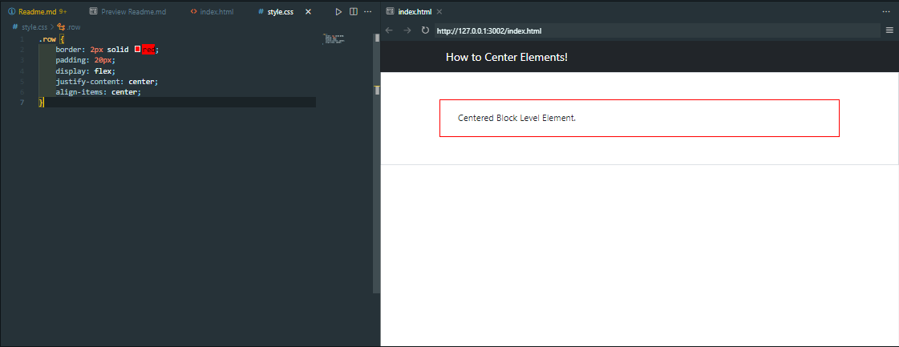
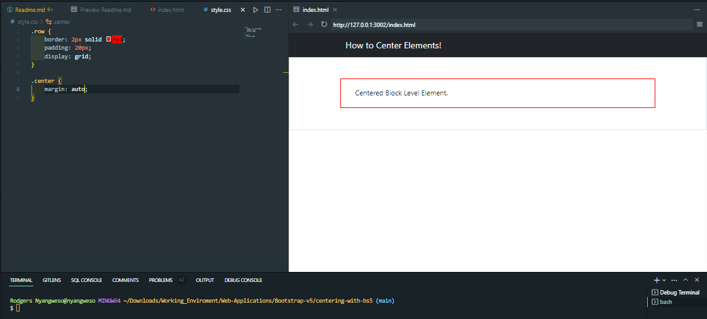
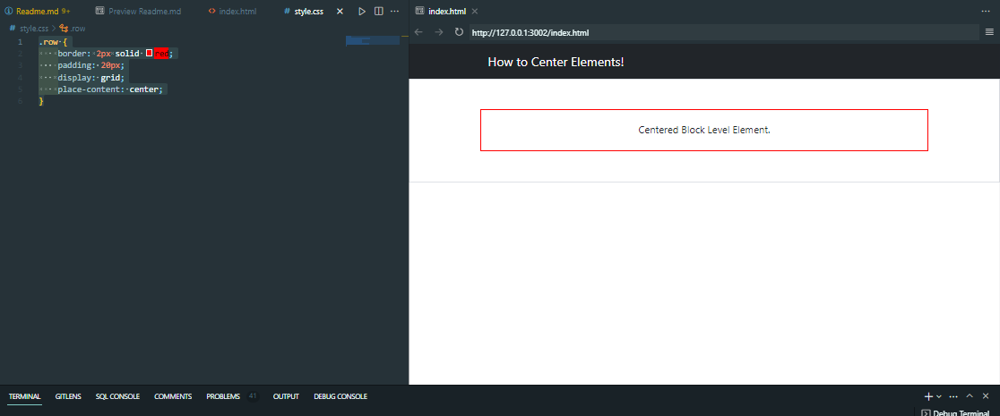

# Centering with Bootstrap 5

# How to Center Div Elements
* 4 ways to Center Elements:
    1. Using `Flex` and `Margin`
    2. Using `Flexbox` property
    3. Using Grid and Margin
    4. Using Grid property

* Conside the following `HMTL`:
    ```html
        <!DOCTYPE html>

        <html>
        <head>
            <meta charset="utf-8">
            <meta http-equiv="X-UA-Compatible" content="IE=edge">
            <title></title>
            <meta name="description" content="">
            <meta name="viewport" content="width=device-width, initial-scale=1">

            <!-- Google Fonts -->
            <link rel="stylesheet" href="https://fonts.googleapis.com/css?family=Sofia|Trirong|Actor">

            <!-- Latest compiled and minified CSS -->
            <link href="https://cdn.jsdelivr.net/npm/bootstrap@5.2.3/dist/css/bootstrap.min.css" rel="stylesheet">
            <!-- Latest compiled JavaScript -->
            <script src="https://cdn.jsdelivr.net/npm/bootstrap@5.2.3/dist/js/bootstrap.bundle.min.js"></script>
            <link rel="stylesheet" href="style.css">
        </head>
        <body>
            <header>
                <nav class="navbar navbar-expand-md navbar-dark bg-dark">
                    <div class="container">
                        <span class="navbar-brand">Center Elements</span>
                    </div>
                </nav>
            </header>
            <section class="border p-5">  
                <div class="container">
                    <div class="row">
                        <div class="center">
                            Centered Block Level Element.
                        </div>
                    </div>
                </div>
            </section>
            <script src="index.js" async defer></script>
        </body>
        </html>
    ```

# Task 1: Using `Flex` and `Margin`
* The `css` looks like this:
    ```css
        .row {
            border: 2px solid red;
            display: flex;
        }

        .center {
            margin: auto;
            padding: 20px;
        }
    ```
* Output:


# Task 2: Using `Flexbox` Property
* The `css` looks like this:
    ```css
        .row {
            border: 2px solid red;
            padding: 20px;
            display: flex;
            justify-content: center;
            align-items: center;
        }
    ```
* Output:


# Task 3: Using `Grid` and  `Margin`
* The `css` looks like this:
    ```css
        .row {
            border: 2px solid red;
            padding: 20px;
            display: grid;
        }

        .center {
            margin: auto;
        }
    ```
* Output:


# Task 4: Using `Grid` Property
* The `css` looks like this:
    ```css
        .row {
            border: 2px solid red;
            padding: 20px;
            display: grid;
            place-content: center;
        }
    ```
* Output:
