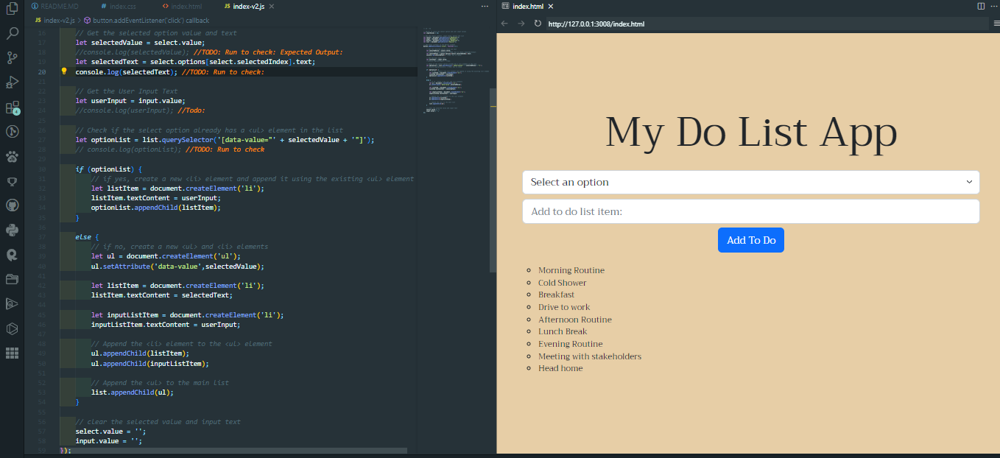

# Project: Create a `To-Do-List` App

# Description
* Using `html`, `css`, `bootstrap5` and `javascript` to create a `To-Do-List-App`

# Output

# Details
# `index-v2.js`
* This file contains an updated version of the `To-Do-List-App` logic where the output of the User Input Items are aggregated per the selected option.